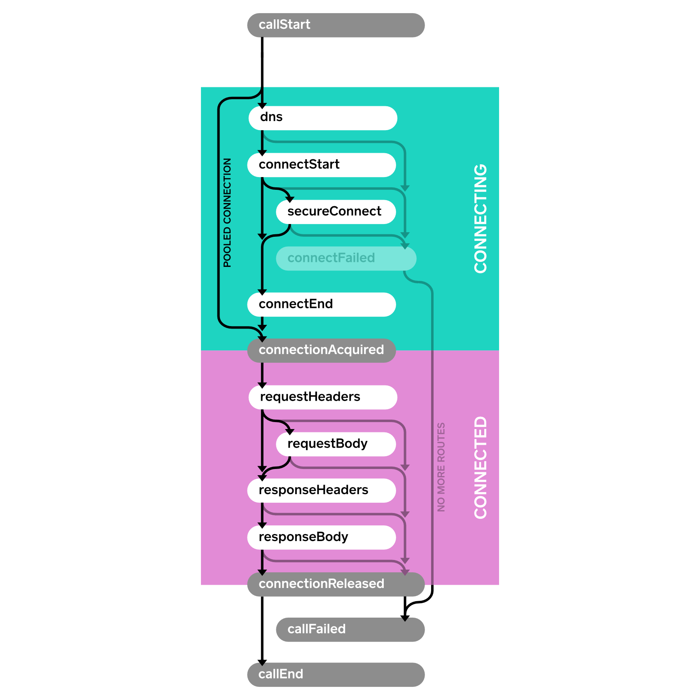

# Events

Events可以让你采集自己应用的HTTP请求的各项指标。使用events可以监控：

- HTPP请求的大小和频率。如果请求过多，或者请求太大，你应该知道。
- 请求在底层网络上的性能。如果网络性能不好，你应该提高网络性能或者少使用一些。

### EventListener

继承EventListener，为那些你感兴趣的事件重写方法。一个没有重定向和重试的HTTP请求正常事件流：


下面是一个 [sample event listener](https://github.com/square/okhttp/blob/master/samples/guide/src/main/java/okhttp3/recipes/PrintEventsNonConcurrent.java) 打印了每个事件的时间戳。

```
class PrintingEventListener extends EventListener {
  private long callStartNanos;

  private void printEvent(String name) {
    long nowNanos = System.nanoTime();
    if (name.equals("callStart")) {
      callStartNanos = nowNanos;
    }
    long elapsedNanos = nowNanos - callStartNanos;
    System.out.printf("%.3f %s%n", elapsedNanos / 1000000000d, name);
  }

  @Override public void callStart(Call call) {
    printEvent("callStart");
  }

  @Override public void callEnd(Call call) {
    printEvent("callEnd");
  }

  @Override public void dnsStart(Call call, String domainName) {
    printEvent("dnsStart");
  }

  @Override public void dnsEnd(Call call, String domainName, List<InetAddress> inetAddressList) {
    printEvent("dnsEnd");
  }

  ...
}
```

我们来做一些请求：

```
Request request = new Request.Builder()
    .url("https://publicobject.com/helloworld.txt")
    .build();

System.out.println("REQUEST 1 (new connection)");
try (Response response = client.newCall(request).execute()) {
  // Consume and discard the response body.
  response.body().source().readByteString();
}

System.out.println("REQUEST 2 (pooled connection)");
try (Response response = client.newCall(request).execute()) {
  // Consume and discard the response body.
  response.body().source().readByteString();
}
```

打印了如下的事件：

```
REQUEST 1 (new connection)
0.000 callStart
0.010 dnsStart
0.017 dnsEnd
0.025 connectStart
0.117 secureConnectStart
0.586 secureConnectEnd
0.586 connectEnd
0.587 connectionAcquired
0.588 requestHeadersStart
0.590 requestHeadersEnd
0.591 responseHeadersStart
0.675 responseHeadersEnd
0.676 responseBodyStart
0.679 responseBodyEnd
0.679 connectionReleased
0.680 callEnd
REQUEST 2 (pooled connection)
0.000 callStart
0.001 connectionAcquired
0.001 requestHeadersStart
0.001 requestHeadersEnd
0.002 responseHeadersStart
0.082 responseHeadersEnd
0.082 responseBodyStart
0.082 responseBodyEnd
0.083 connectionReleased
0.083 callEnd
```

可以看到，第二次请求的事件中没有链接事件。为了极大的提高性能，它重用的第一次的链接。

### EventListener.Factory

前面的例子中，我们使用了一个字段 `callStartNanos`来跟踪每个事件花费的时间。这样做非常方便，但是如果有多个请求同时进行，这个方法就不好用了。为了解决这个问题，使用 `Factory` 来为每个`Call`创建一个新的 `EventListener` 。这样就可以让每个监听器监听指定的请求。

下边的 [sample factory](https://github.com/square/okhttp/blob/master/samples/guide/src/main/java/okhttp3/recipes/PrintEvents.java) 为每个请求创建一个唯一的ID，然后使用这个ID在日志中来区别每个不同的请求。

```
class PrintingEventListener extends EventListener {
  public static final Factory FACTORY = new Factory() {
    final AtomicLong nextCallId = new AtomicLong(1L);

    @Override public EventListener create(Call call) {
      long callId = nextCallId.getAndIncrement();
      System.out.printf("%04d %s%n", callId, call.request().url());
      return new PrintingEventListener(callId, System.nanoTime());
    }
  };

  final long callId;
  final long callStartNanos;

  public PrintingEventListener(long callId, long callStartNanos) {
    this.callId = callId;
    this.callStartNanos = callStartNanos;
  }

  private void printEvent(String name) {
    long elapsedNanos = System.nanoTime() - callStartNanos;
    System.out.printf("%04d %.3f %s%n", callId, elapsedNanos / 1000000000d, name);
  }

  @Override public void callStart(Call call) {
    printEvent("callStart");
  }

  @Override public void callEnd(Call call) {
    printEvent("callEnd");
  }

  ...
}
```

我们可以使用这个监听来测试一组同步进行的HTTP请求：

```
Request washingtonPostRequest = new Request.Builder()
    .url("https://www.washingtonpost.com/")
    .build();
client.newCall(washingtonPostRequest).enqueue(new Callback() {
  ...
});

Request newYorkTimesRequest = new Request.Builder()
    .url("https://www.nytimes.com/")
    .build();
client.newCall(newYorkTimesRequest).enqueue(new Callback() {
  ...
});
```

在一个家用的WIFI上测试，第二个请求比第一个请求快一点点完成：

```
0001 https://www.washingtonpost.com/
0001 0.000 callStart
0002 https://www.nytimes.com/
0002 0.000 callStart
0002 0.010 dnsStart
0001 0.013 dnsStart
0001 0.022 dnsEnd
0002 0.019 dnsEnd
0001 0.028 connectStart
0002 0.025 connectStart
0002 0.072 secureConnectStart
0001 0.075 secureConnectStart
0001 0.386 secureConnectEnd
0002 0.390 secureConnectEnd
0002 0.400 connectEnd
0001 0.403 connectEnd
0002 0.401 connectionAcquired
0001 0.404 connectionAcquired
0001 0.406 requestHeadersStart
0002 0.403 requestHeadersStart
0001 0.414 requestHeadersEnd
0002 0.411 requestHeadersEnd
0002 0.412 responseHeadersStart
0001 0.415 responseHeadersStart
0002 0.474 responseHeadersEnd
0002 0.475 responseBodyStart
0001 0.554 responseHeadersEnd
0001 0.555 responseBodyStart
0002 0.554 responseBodyEnd
0002 0.554 connectionReleased
0002 0.554 callEnd
0001 0.624 responseBodyEnd
0001 0.624 connectionReleased
0001 0.624 callEnd
```

 `EventListener.Factory`也让监控一些请求成为可能。下边的例子随机监控：

```
class MetricsEventListener extends EventListener {
  private static final Factory FACTORY = new Factory() {
    @Override public EventListener create(Call call) {
      if (Math.random() < 0.10) {
        return new MetricsEventListener(call);
      } else {
        return EventListener.NONE;
      }
    }
  };

  ...
}
```

### Events with Failures

当一个操作失败，失败的方法会被调用。和服务建立链接时会调用 `connectFailed()` ，HTTP请求永久失败时会调用 `callFailed()` 。当失败发生时，通常一个 `start` 事件就不会有对应的 `end` 事件了。



### Events with Retries and Follow-Ups

OkHttp是可恢复的，可以从一些链接失败中自动恢复。这时， `connectFailed()` 事件不是终点，后边不会出现

 `callFailed()`，当重试时，事件监听器会收到同一个类型的多次事件。

一个HTTP请求可能需要多个跟随请求来处理验证问题，重定向和HTTP层的超时。这时，多次链接，请求，和响应就产生了。跟随请求是一个请求触发同一个事件多次的另外一个原因。


### Availability

事件在OkHttp 3.11开始成为公开的API。后续的发布可能引进新的事件类型，你需要重定对应的方法来处理它们。